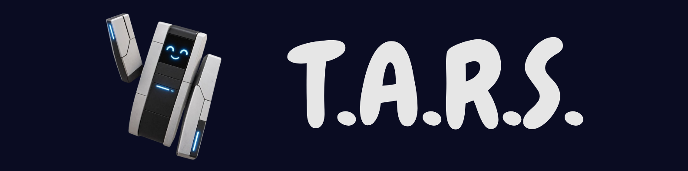
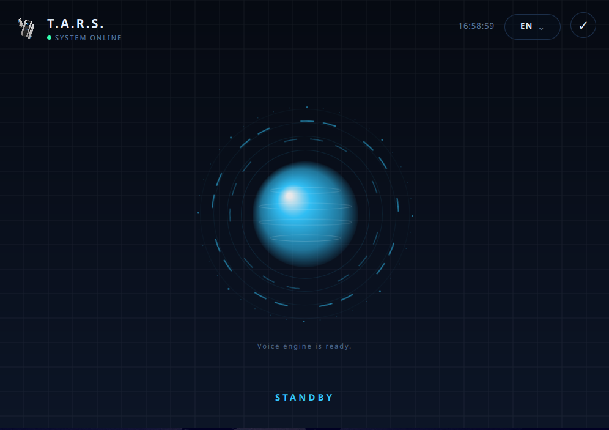
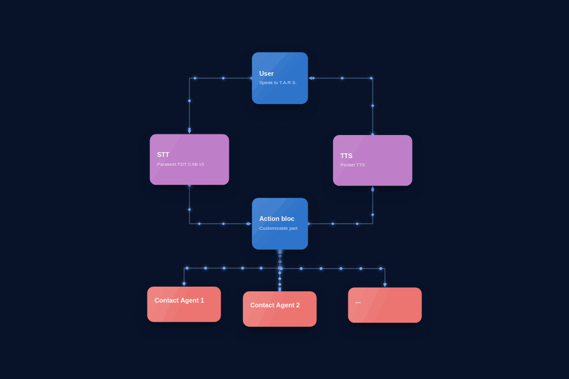

# T.A.R.S.

---

T.A.R.S. is an extremely lightweight local voice assistant built with Python, PySide6, and QML.
It uses Parakeet TDT 0.6B v3 for speech-to-text (STT) and Pocket TTS for text-to-speech (TTS).

After the models have been installed, the application works offline and runs entirely on the CPU.
English is the default language, and Parakeet generally performs better in English than in French.
French remains available from the interface.

T.A.R.S. is not a finished product, but an accessible base for building a personal assistant.
The project is designed to be customized with your own Python agents, voice commands, and responses.
Agent 1 and Agent 2 provide simple examples to start from.

---

## See T.A.R.S. in action



---

## Quickstart

### Install

```bash
python3 -m venv .venv
source .venv/bin/activate
pip install -r requirements.txt
```

### Run

```bash
python3 src/app.py
```

On first launch, use the download button to install the local models. Hold the central sphere while speaking, then release it to receive a response.

## Customizing agents

Create your own Python agent under `src/agents/`, then register it in `src/agents/registry.py`. Add its aliases and contact verbs to `config/responses.toml` so T.A.R.S. can recognize it by voice. Use `Agent 1` and `Agent 2` as examples, and adapt the agent’s `run` method to connect it to your own tools or services.


