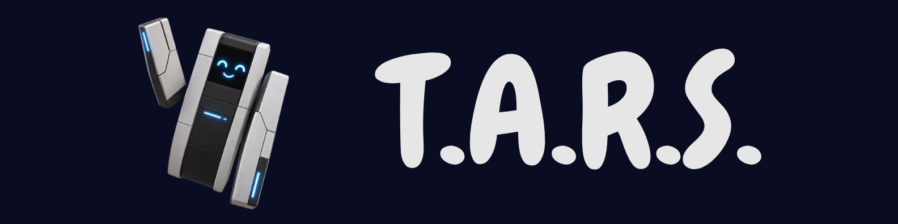
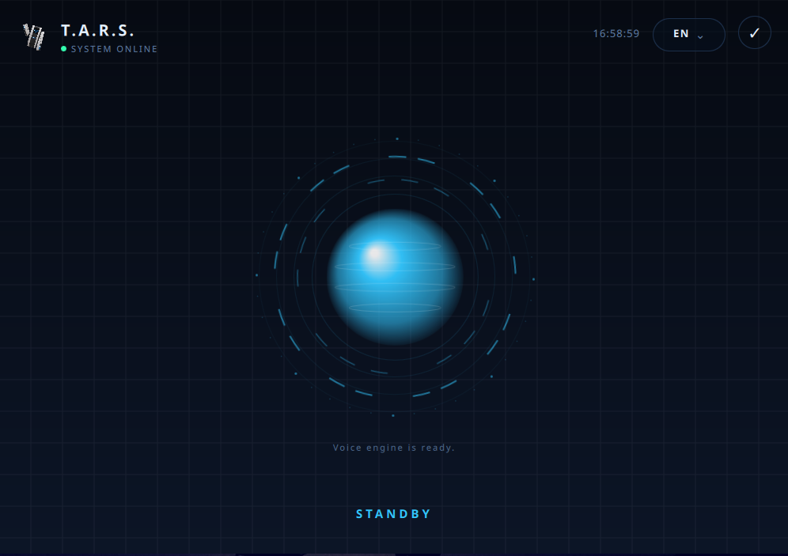
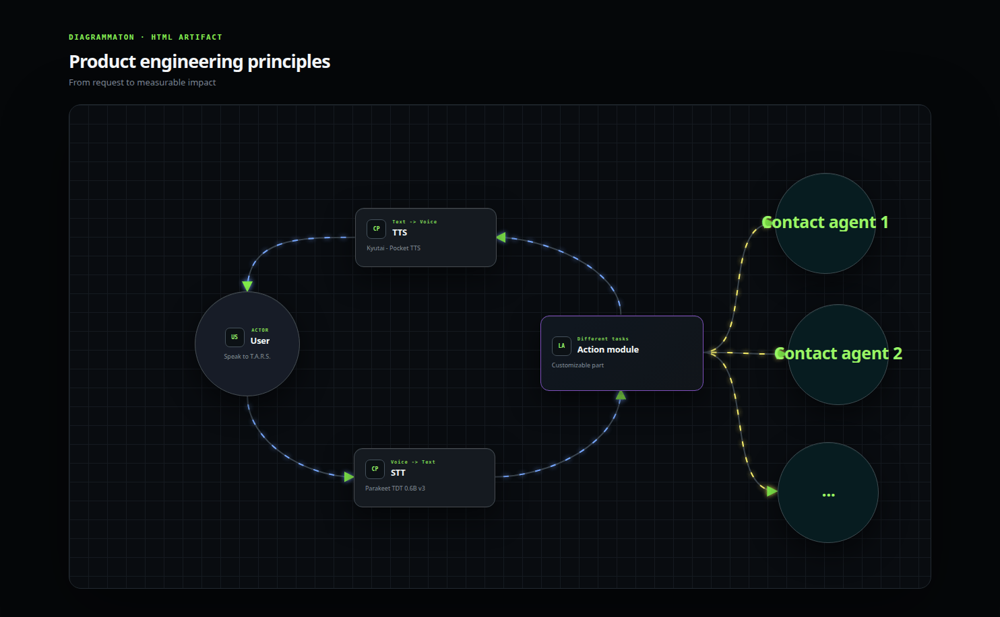

# T.A.R.S.

---

T.A.R.S. is an extremely lightweight local voice assistant built with Python, PySide6, and QML.
It uses Parakeet TDT 0.6B v3 for speech-to-text (STT), GLM 5.3 Flash for responses, and Pocket TTS for text-to-speech (TTS).

STT and TTS run locally on the CPU. GLM requires an internet connection and a Z.AI API key.
English is the default language, and Parakeet generally performs better in English than in French.
French remains available from the interface.

T.A.R.S. is not a finished product, but an accessible base for building a personal assistant.
The interface sends each transcription to GLM and speaks its response.
The app displays its name as “T.A.R.S.”, while the assistant uses “TARS” without periods in spoken responses.

---

## See T.A.R.S. in action



---

## Quickstart

### Install

Install [uv](https://docs.astral.sh/uv/getting-started/installation/) and Python 3.12, then run:

```bash
uv sync
```

### Configure GLM

Set `ZAI_API_KEY` in your environment or create an ignored `.env` file at the project root containing `ZAI_API_KEY=your-key`. The configured model is `glm-5.3-flash`.

### Run

```bash
uv run python src/app.py
```

On first launch, use the download button to install the local models. Hold the animated central orb while speaking, then release it to hear the GLM response. The softly shaded orb changes color and shape as T.A.R.S. listens, processes speech, and speaks.


