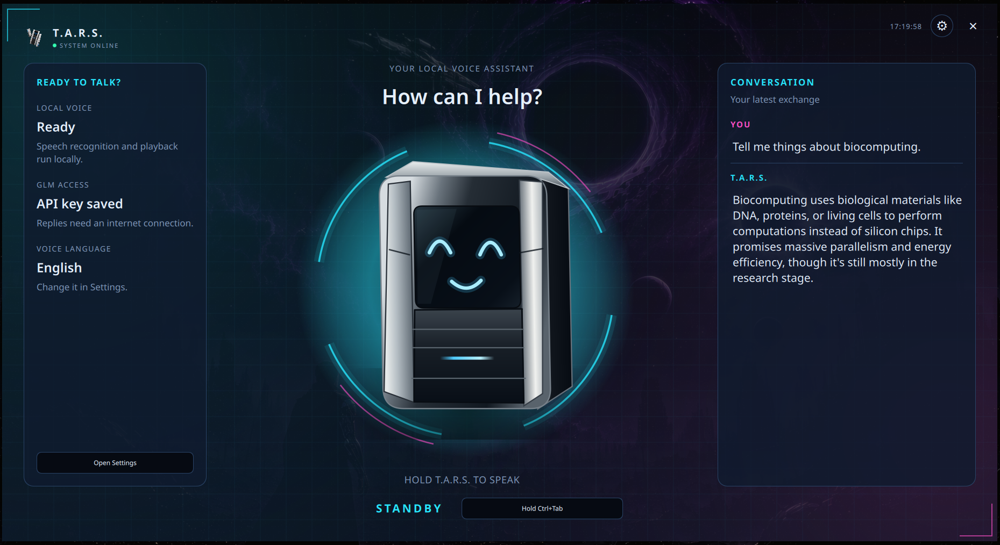

# T.A.R.S.

T.A.R.S. is a local, extensible voice assistant built with Python 3.12, PySide6 and QML. It transcribes speech with Parakeet TDT 0.6B v3, streams concise replies from GLM 5.3 Flash, and speaks with **Piper TTS by default**. **Pocket TTS is also supported and included** as an alternative. STT and both TTS engines run locally on the CPU; GLM requires internet and a Z.AI API key. English is the default language and generally works better with Parakeet; French is also supported. Language and voice selection persist.

GLM normally replies in one or two short sentences, in the selected language. It streams text while T.A.R.S. displays the answer and starts speaking the first complete sentence; long sentences may start at a clause after 240 characters, with a word-boundary fallback at 400. Piper audio streams to Qt as it is synthesized. This keeps replies responsive while preserving phrase intonation. T.A.R.S. is an extensible foundation for a personal assistant; its displayed name is “T.A.R.S.” and its spoken name is “TARS.”



## Install and configure

Install [uv](https://docs.astral.sh/uv/getting-started/installation/) and Python 3.12, then install dependencies and launch:

```bash
uv sync
uv run python src/app.py
```

Linux and Windows use CPU-only PyTorch from its official CPU index; macOS uses its native PyPI wheel. Open Settings to choose English or French, enter and save your Z.AI API key, and click **Download missing models** under **Local models**. Downloads include about 2.5 GB for Parakeet and 63 MB for English Piper; French Piper is included and ready without a download. Other resources install on demand; the screen shows download and loading status and lets you retry failures. To install English Piper, select English and download missing models. Once installed, STT and TTS work offline. T.A.R.S. loads both local models at startup.

The key is stored separately at `~/.tars/config/llm_api_key` with user-only permissions on Linux/macOS; replace or remove it in Settings. Preferences are in `~/.tars/config/config.toml`; downloaded voice resources are in `~/.tars/{stt,tts}`. Set `TARS_DATA_DIR` to use another data root. Legacy settings in a checkout migrate once. GLM uses `glm-5.3-flash` with low reasoning effort.

Parakeet keeps its original full-precision weights memory-mapped from an extracted checkpoint beside the installed `.nemo` file (about 2.5 GB of temporary disk space until shutdown). This avoids a second weight copy during loading and lets the OS reclaim clean weight pages under memory pressure. Keeping it beside the installed model avoids RAM-backed system temporary directories. Resident RAM still grows when transcription touches those pages; the model's size is unchanged. Older checkpoint formats fall back to ordinary loading. Piper uses at most four inference threads, disables thread spinning and releases temporary synthesis allocations. Recording streams to a temporary WAV, and synthesis waits when two audio chunks are queued for playback, preserving all samples and the provider's resampling boundaries. The interface grid uses scene-graph lines, and its clock pauses while hidden or minimized.

## Voices and providers

Piper uses Lessac medium (`en_US-lessac-medium`) for English and Tom medium (`fr_FR-tom-medium`) for French. French Tom runs at 44.1 kHz (English Lessac at 22.05 kHz). French loads `model.onnx` and `model.onnx.json` from `src/providers/tts/fr-tom-medium` in both the checkout and exports, taking priority over downloaded French voices. Missing or incomplete bundled files fall back to the existing download flow. Conversational pacing and punctuation pauses apply to streaming and WAV output. Only French Piper uses 2% longer phoneme durations (`length_scale=1.02`), gentle compression (1.5:1, −18 dBFS, 6 dB soft knee, 10 ms attack/120 ms release) and light EQ (+1 dB at 180 Hz, −1.5 dB at 3.5 kHz), without per-sentence normalization. English Piper and Pocket TTS keep their own voices and settings. Piper's engine is GPL-3.0; see the [Lessac](https://huggingface.co/rhasspy/piper-voices/blob/main/en/en_US/lessac/medium/MODEL_CARD) and [Tom](https://huggingface.co/rhasspy/piper-voices/blob/main/fr/fr_FR/tom/medium/MODEL_CARD) voice licenses (Tom: AGPLv3).

Pocket TTS remains available in `src/providers/tts/pocket_tts.py`, and its engine is included in application exports. To select it instead of default Piper, change the import in `src/providers/tts/adapter.py` to:

```python
from providers.tts.pocket_tts import PocketTTSProvider as TTSAdapter
```

An existing Pocket TTS installation does not need to be removed; French Piper works immediately, while English Piper requires its voice download. Providers under `src/providers/{stt,tts,llm}` implement their service contracts, and `adapter.py` selects the active provider. To add an LLM, implement `complete(text, language, history)` and optionally `stream(text, language, history)`, then select it in `src/providers/llm/adapter.py`. `LLMService` also accepts an injected provider. `GLMProvider` accepts another OpenAI-compatible `LLMConfig`; its GLM-specific reasoning option is sent only for the default model.

## Use the interface

Hold the central robot head while speaking, then release it to send the transcription to GLM. The assistant becomes available again after its reply finishes playing. The frameless, resizable window has a custom close button and draggable upper area. Its semi-transparent midnight-blue background combines cyan/magenta accents, a grid and neon corners; colored haze and grain simulate frosted glass, while transparency requires a compositor. The 3D robot head flexes and glows with the listening, processing and speaking states.

The minimum window is 600 × 560; the default is 1000 × 700 at X=100, Y=100. In Settings, save full-screen startup or a window size and desktop-pixel position for the next launch; negative coordinates support displays above or left of the primary one. Placement may be constrained by the window manager, especially on Wayland. Closing with **×** hides T.A.R.S. to the tray when available, otherwise it quits. Reopening from the tray preserves full-screen mode.

The responsive layout scales the head and text. Below 960 × 640, **Conversation** opens the latest exchange in a scrollable dialog; at 960 × 640 it appears in a side panel, and at 1450 × 760 the interface can also show voice, API and language readiness plus a shortcut reminder that opens Settings. The panels show current-session status, not conversation history.

## Global shortcut and tray

On Linux X11 (including Mint XFCE), Windows and macOS, configure **Set shortcut…** in Settings and save a key combination. Hold it to talk while T.A.R.S. is hidden; release it to submit. Use Ctrl, Alt or Super with a key (for example, Ctrl+Alt+Space), or a function key. On macOS, Qt's Ctrl modifier represents Command. The shortcut is saved in `~/.tars/config/config.toml`; conflicts are rejected and **Remove** disables it. Shortcuts are unavailable on Linux Wayland. T.A.R.S. ignores the shortcut while models load or a request is processing, and key repeat does not submit twice.

Click the tray robot or choose **Open T.A.R.S.** to reopen the window; choose **Quit** to exit. Without a system tray, closing quits. Linux uses X11 and `python-xlib`; Windows and macOS use native registration.

## Tests

Run the standard suite:

```bash
uv run --project . --directory src python -m unittest discover -s ../tests
```

For real Piper downloads and English/French synthesis tests—including WAV, streaming, language switching, cancellation and simulated Qt playback—run:

```bash
TARS_TEST_PIPER=1 uv run --project . --directory src python -m unittest discover -s ../tests -p test_piper_tts.py -v
```

This optional test downloads temporary voices. It covers French accents, apostrophes and numbers.

## Export an application

Build on the target OS and CPU architecture; PyInstaller does not cross-compile. Settings can export a native bundle asynchronously (Linux is listed first and your OS is selected by default); it creates a new destination folder or copies an existing bundle. The Linux path is tested; test Windows/macOS builds on those platforms before distributing them.

Install build tools with `uv sync --group build`, then use the UI or run:

| Platform | Build command | Executable |
| --- | --- | --- |
| Linux | `uv run --group build python scripts/build_app.py --platform linux` | `dist/TARS-linux-*/TARS/TARS` |
| Windows | `uv run --group build python scripts/build_app.py --platform windows` | `dist/TARS-windows-*/TARS/TARS.exe` |
| macOS | `uv run --group build python scripts/build_app.py --platform macos` | `dist/TARS-macos-*/TARS.app` |

Builds include Python, Qt/QML, the mascot, Parakeet/NeMo, Piper with phonemizer data and the French Tom model (~64 MB), Pocket TTS and dependencies. Distribute the complete `TARS` folder or `TARS.app`, not only the executable. Exports use CPU-only PyTorch, scan recursive QML imports, omit unrelated Qt modules and PyTorch's self-test payload, clear PyInstaller's analysis cache, and strip Linux debug symbols. Downloaded models and personal settings stay outside the bundle. Build Linux on the oldest distribution to support; its system still needs compatible display/audio libraries and a tray for background operation. macOS may ask for microphone access; signing and notarization are separate distribution steps.

After a Linux build, close exported T.A.R.S. and install the latest bundle into `~/.local/lib/tars`, adding an application-menu launcher:

```bash
uv run python scripts/install_linux.py --clean-dist
```

`--clean-dist` removes older Linux exports from `dist`; omit it to keep them. Install another bundle with `uv run python scripts/install_linux.py /path/to/TARS`. Launch from the menu or `~/.local/lib/tars/TARS`. To uninstall, remove `~/.local/lib/tars` and its `tars.desktop` launcher; remove `~/.tars` separately to delete personal data.

Check an exported Linux bundle with:

```bash
/path/to/TARS/TARS --check-bundle
/path/to/TARS/TARS --check-bundle --check-models
/path/to/TARS/TARS --check-bundle --check-shortcut
```

The first checks QML assets and voice imports. `--check-models` also synthesizes Piper samples in both languages and transcribes with Parakeet; installed Pocket voices are checked too. `--check-shortcut` tests X11 handling. These checks neither download models nor call APIs; temporary audio is removed. Logs are in `~/.tars/logs/tars.log`.
