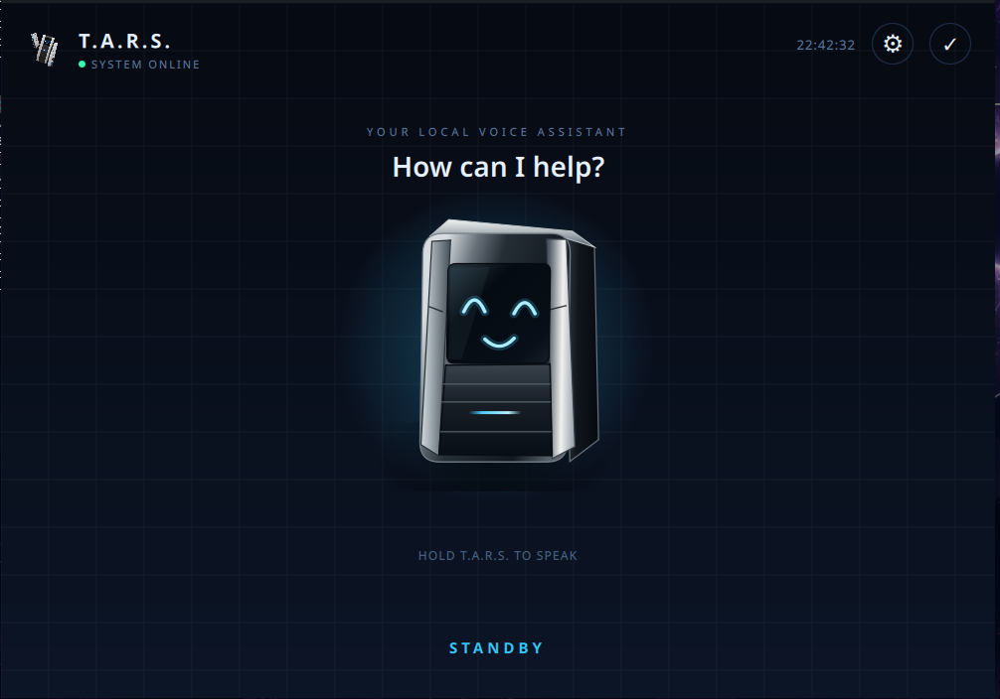

# T.A.R.S.

---

T.A.R.S. is an extremely lightweight local voice assistant built with Python, PySide6, and QML.
It uses Parakeet TDT 0.6B v3 for speech-to-text (STT), GLM 5.3 Flash for responses, and Pocket TTS for text-to-speech (TTS).

STT and TTS run locally on the CPU. GLM requires an internet connection and a Z.AI API key.
English is the default language, and Parakeet generally performs better in English than in French.
French remains available in Settings. The selected application and voice language is saved for later launches.

T.A.R.S. is not a finished product, but an accessible base for building a personal assistant.
The interface sends each transcription to GLM and speaks its response.
By default, GLM gives a brief spoken reply to reduce response time; you can ask for more detail when needed.
The app displays its name as “T.A.R.S.”, while the assistant uses “TARS” without periods in spoken responses.

---

## See T.A.R.S. in action



---

## Quickstart

### Install

Install [uv](https://docs.astral.sh/uv/getting-started/installation/) and Python 3.12, then run:

```bash
uv sync
```

### Configure GLM

Open the gear in the upper right to choose the application and voice language and enter your Z.AI API key. Save it there before using GLM. The key stays in the local `~/.tars/config/llm_api_key` file (user-only permissions on Linux/macOS). You can replace or remove it from the same dialog. The configured model is `glm-5.3-flash`.

Providers live in `src/providers/stt`, `src/providers/tts`, and `src/providers/llm`. GLM 5.3 Flash is implemented in `glm_5_3_flash.py`. Each `adapter.py` only selects the provider used by its service; local resource installation and voice selection belong to the STT/TTS providers. To switch models, implement a provider with the same `complete(text, language, history)` method and change the import in `src/providers/llm/adapter.py`. You can also pass a provider directly to `LLMService`. For an OpenAI-compatible chat endpoint, supply a different `LLMConfig` to `GLMProvider`.

### Run

```bash
uv run python src/app.py
```

On first launch, use the download button to install the local models. On later launches, T.A.R.S. loads both local models before the central robot head becomes available. Once loading finishes, hold the head while speaking, then release it to hear the GLM response. The central control shows an animated 3D robot head inspired by the app mascot. Its shell and expression flex as T.A.R.S. listens, processes speech, and speaks, while the surrounding glow changes color with the state.

### Run the tests

```bash
uv run --project . --directory src python -m unittest discover -s ../tests
```

### Use T.A.R.S. from the system tray

On Linux Mint XFCE with an X11 session, Windows, or macOS, launch T.A.R.S. once, install the models, and save your API key. In Settings, click **Set shortcut…**, press your chosen key combination, and click **Save shortcut**. Use Ctrl, Alt, or Super with a key (for example, Ctrl+Alt+Space), or a function key. On macOS, Qt's portable Ctrl modifier represents Command. The shortcut is saved in `~/.tars/config/config.toml` and restored on later launches. Conflicting shortcuts are rejected; choose a different combination if another application or the desktop already uses it. **Remove** disables the shortcut.

Closing the window keeps T.A.R.S. running behind the robot icon in the system tray. From any application, hold your shortcut while speaking, then release it to send your request and hear the answer. T.A.R.S. must have finished loading its models; shortcuts are ignored while it is processing or speaking. The recording stops when you release the main key. Keyboard auto-repeat does not submit extra requests.

Click the robot icon or choose **Open T.A.R.S.** from its menu to reopen the window. Choose **Quit** from that menu to stop the application completely. If the desktop has no system tray, closing the window quits normally; enable the XFCE panel's tray to keep T.A.R.S. in the background. On Linux, global shortcuts require X11 and are unavailable under Wayland. Windows and macOS use native shortcut registration. Run `uv sync` after updating to install the dependencies.

## Export an executable

Install build tools and relaunch the source application:

```bash
uv sync --group build
uv run --group build python src/app.py
```

In Settings, choose **Export application…**. Linux appears first, followed by Windows and macOS; your current OS is selected automatically. Select **Export…** and choose a destination. The interface stays responsive and shows the build log. The destination opens after a successful export. Each export creates a new folder, preserving earlier exports. From an already exported application, this button copies its complete bundle.

You can also build from a terminal (Linux first):

| Build on | Command | Launch the result |
| --- | --- | --- |
| Linux | `uv run --group build python scripts/build_app.py --platform linux` | `dist/TARS-linux-*/TARS/TARS` |
| Windows | `uv run --group build python scripts/build_app.py --platform windows` | `dist/TARS-windows-*/TARS/TARS.exe` |
| macOS | `uv run --group build python scripts/build_app.py --platform macos` | `dist/TARS-macos-*/TARS.app` |

Add `--output /path/to/destination` to choose another output folder. Build on the target OS and CPU architecture; PyInstaller does not cross-compile between operating systems. On Linux, build on the oldest distribution you intend to support. Windows/macOS builds must be checked on those systems before distributing them.

The export includes Python, Qt/QML, the robot icon, Parakeet/NeMo, Pocket TTS and their dependencies. **Distribute the entire `TARS` folder or `TARS.app`**, including its libraries; copying only the executable will not work. Bundles can occupy several gigabytes. Linux still needs compatible system display/audio libraries and a tray-enabled desktop. On macOS, allow microphone access when prompted; signing/notarization for distribution is a separate release step.

Personal settings and API keys are never embedded in the export. Source and exported applications share `~/.tars/config` for settings and `~/.tars/{stt,tts}` for downloaded resources on the same computer. Legacy checkout settings in `config/` are imported once when you next run the source application or build an export. On another computer, configure the key/shortcut and download the required English/French resources from the interface. STT/TTS then work offline; GLM still requires internet access. `TARS_DATA_DIR` can override the writable data folder.

To check a Linux bundle from a terminal:

```bash
/path/to/TARS/TARS --check-bundle
/path/to/TARS/TARS --check-bundle --check-models
/path/to/TARS/TARS --check-bundle --check-shortcut
```

The first command checks QML assets and voice-engine imports without recording or making an API request. The second also loads installed language voices and Parakeet, reporting missing voice resources. It does not download models. The third checks shortcut registration, conflict detection and release in an X11 session. Exported applications write logs to `~/.tars/logs/tars.log`.
